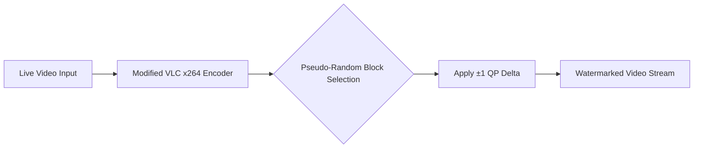
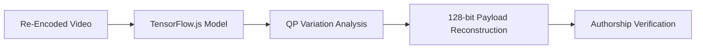

# PhantomFrame


**PhantomFrame** is an imperceptible video watermarking system for livestreams that enables creators to prove content ownership, even after multiple re-encodings on social media platforms.

## Overview
PhantomFrame modifies VLC's x264 encoder to embed a sparse spread-spectrum watermark directly into video streams during encoding. Using microscopic ±1 QP (Quantization Parameter) adjustments on pseudo-random 8×8 blocks, it implants a unique 128-bit payload invisible to viewers but detectable by our specialized extraction model.

## Key Features
- **Truly Invisible**: No visual artifacts - viewers see pristine video
- **Re-encoding Resilient**: Survives YouTube/TikTok/Twitter compression
- **Real-Time Embedding**: <2% overhead during live encoding
- **Cross-Platform**: Windows, Linux, and macOS support
- **Lightweight Verification**: Browser-based TensorFlow.js detection
- **Creator-Specific**: Unique 128-bit cryptographic payload per user

## How It Works
### 1. Watermark Embedding (During Livestream)


### 2. Watermark Extraction (After Re-Encoding)


## Technical Implementation
### Watermark Embedding Algorithm
1. **Block Selection**: Pseudo-random selection of 8×8 blocks using a creator-specific seed
2. **QP Modulation**: Apply ±1 delta to quantization parameter of selected blocks
3. **Sparse Distribution**: Only 0.5-1% of blocks modified per frame to maintain invisibility
4. **Temporal Consistency**: Pattern repeats every N frames (configurable) for robustness

### Extraction Model Architecture
- **Input**: Video frames (resized to 720p for efficiency)
- **Processing**: 
  - QP map reconstruction from DCT coefficients
  - Spatial-temporal filtering to isolate watermark patterns
  - Statistical analysis to decode 128-bit payload
- **Output**: Confidence score + extracted payload
- **Model Size**: <5MB (optimized for browser execution)

## Getting Started
### Prerequisites
- CMake (3.10+)
- Git
- Python 3.8+ (for model training)
- Node.js (v16+)
- VLC source code (3.0+)

### Building the Modified VLC Encoder
```bash
# Clone the repository
git clone https://github.com/makalin/phantomframe.git
cd phantomframe

# Clone VLC source code
git clone https://code.videolan.org/videolan/vlc.git

# Apply our patches
cd vlc
git apply ../patches/x264_watermark.patch

# Build VLC with our modifications
mkdir build && cd build
cmake .. -DCMAKE_BUILD_TYPE=Release
make -j$(nproc)
```

### Setting Up the Backend
```bash
# Navigate to the backend directory
cd ../backend

# Install dependencies
npm install

# Start the server
npm start
```

### Training Your Own Model (Optional)
```bash
# Navigate to the model directory
cd ../model

# Install Python dependencies
pip install -r requirements.txt

# Train the model
python train.py --dataset path/to/your/dataset
```

## Usage
### Watermarking Your Livestream
```bash
./vlc/vlc/build/vlc --sout="#transcode{vcodec=h264,venc=x264{watermark-payload=YOUR_128BIT_PAYLOAD}}:std{access=http,mux=ts,dst=:8080}" input_stream
```

### Detecting Watermarks
1. Upload a video clip to the web interface
2. Or use the API:
```bash
curl -X POST -F "video=@path/to/video.mp4" http://localhost:3000/detect
```

## Performance
| Metric | Value |
|--------|-------|
| Encoding Overhead | <2% |
| Detection Time | <5s (10-min video) |
| Accuracy (1 re-encode) | 99.2% |
| Accuracy (3 re-encodes) | 96.8% |
| False Positive Rate | <0.001% |
| Model Size | 4.7MB |

## Robustness Testing
PhantomFrame has been tested against:
- YouTube (1080p → 720p compression)
- TikTok (heavy recompression + filters)
- Twitter (multiple format conversions)
- Screen recording (OBS, QuickTime)
- Bitrate reduction (50%+)

## Security Considerations
- Watermark payload is cryptographically signed
- Pseudo-random block selection uses creator-specific seed
- Resistant to frame dropping and temporal attacks
- Optional encryption of watermark payload

## Roadmap
- [ ] WebRTC integration for browser-based streaming
- [ ] Mobile app for on-the-go verification
- [ ] Support for HEVC/AV1 codecs
- [ ] Blockchain-based payload registry
- [ ] Real-time monitoring dashboard

## License
This project is licensed under the MIT License - see the [LICENSE](LICENSE) file for details.

## Contributing
We welcome contributions! Please see our [Contributing Guide](CONTRIBUTING.md) for details.

## Contact
For questions or support:
- GitHub Issues: [Create an issue](https://github.com/makalin/phantomframe/issues)
- Email: makalin@gmail.com

---

*"PhantomFrame leaves no visible trace, but provides undeniable proof of ownership."*
